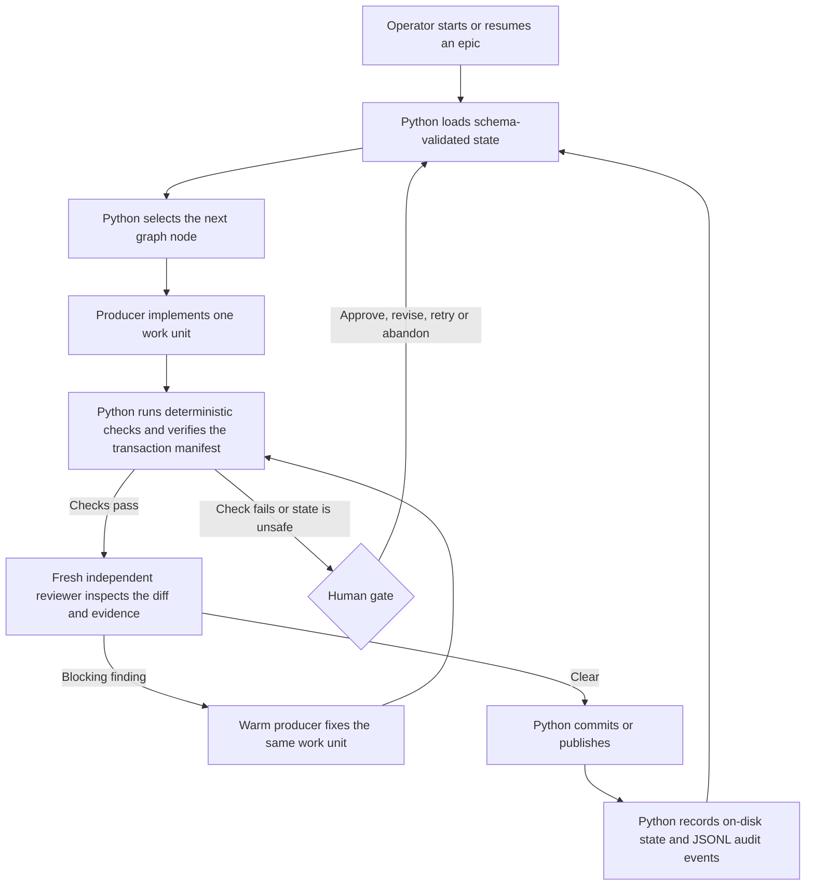

# Woof

Woof is a Python command-line tool that turns an epic or a pre-decomposed set of work units into checked code changes. It records the workflow on disk so an operator can inspect a run, resolve a gate and resume after a stopped process.

Python controls the workflow graph, state transitions, schema validation, deterministic checks, transaction manifests, audit records and commit or publish decisions. Coding agents implement one bounded work unit or review the resulting diff through interactive command-line sessions; they do not choose the next workflow step.

Woof is installable and under active development. The planned disposable and real deployment proof runs have not completed. Until they pass, Woof should not replace an established runner for deployment-sensitive work.

## Install and inspect

Install the current main branch with `uv`, then inspect the command surface:

```bash
uv tool install git+https://github.com/krazyuniks/woof@main
woof --help
```

Woof ships the Python engine and two Claude Code skills under `skills/`. Operators use `/woof` to run epics and `/woof:brainstorm` to design them.

## Workflow control



The graph derives its next action from the files under `.woof/` before each node. A producer stays attached for bounded fix rounds, while each review round starts with an independent reviewer and the complete current diff. Failed checks, malformed state and decisions that require operator judgement open typed gates instead of letting a coding agent continue by assumption.

## Consumer setup

Run Woof against the repository you want it to manage. The `/woof` skill walks through onboarding in [`skills/woof/references/setup.md`](skills/woof/references/setup.md):

```bash
woof init
```

`woof init` scaffolds `.woof/`, including `policy.toml` for the delivery path, verification command, producer and reviewer run profiles, minimum deterministic checks and minimum codebase documentation. You then author the target architecture and design principles, install the cartography hook with `woof hooks install`, and start an epic:

```bash
woof wf new "<spark>"
```

Woof can also ingest a pre-decomposed `work_units[]` source:

```bash
woof wf intake --source PATH
```

## Operator workflow

Operators use `/woof` for engine commands and `/woof:brainstorm` for the interactive design process. [ADR-007](docs/adr/007-operator-skill-umbrella.md) records this boundary.

| Skill | Use |
|---|---|
| `/woof` | Map operator requests to `woof` commands for setup, epic execution, pre-decomposed intake, gate resolution, reset and observation. |
| `/woof:brainstorm` | Run the two design loops, write the resulting design bundle and hand the epic back to `woof wf`. |

Run an epic with:

```bash
woof wf --epic N
```

This command reads the epic state under `.woof/`, advances the graph, dispatches producer or reviewer sessions where required, runs deterministic nodes in process and stops when an operator decision is needed. Resolve the current gate with a typed decision:

```bash
woof wf --epic N --resolve <decision>
```

The files on disk remain authoritative if the operator starts a new shell session. `woof wf reset --epic N` returns an epic to its original request and requires confirmation.

The graph checks contract readiness after definition and before planning. Once `EPIC.md` exists, Woof can check whether acceptance criteria are machine-checkable, contract decisions are concrete and referenced existing paths resolve before a coding agent decomposes the work.

## Architecture and engineering choices

- Typed execution contracts define graph inputs, outputs, work-unit state, gate decisions and dispatch results. Pydantic validates Python boundaries, while JSON Schema defines durable files and interoperability contracts.
- `work_units[]` is the one executable shape. The aggregate validates local identity, dependency closure, cycle freedom and topological order before the graph runs.
- Repository-local files under `.woof/` currently hold policy, plans, gates, audit events and recovery state. The graph reloads those files before each transition, so a live agent session is an execution resource rather than workflow authority.
- Policy selects pull request or single-tree delivery, the verification command, producer and reviewer run profiles, minimum deterministic checks and minimum codebase documentation. These values activate capabilities on one engine path instead of creating separate workflow implementations.
- A retained producer handles bounded fix rounds, and a fresh reviewer inspects every round. Deterministic checks run before review and again where the delivery profile requires them.
- The engine checks staged paths and transaction manifests before the graph commits or publishes a change. JSON Lines (JSONL) events record state changes, dispatch activity, gate decisions and manifest verification.
- Coding agents run through interactive harness profiles. The implemented path uses tmux; [ADR-012](docs/adr/012-interactive-harness-dispatch.md) defines the transport boundary and the planned retained herdr path. Headless one-shot reasoning commands are outside the delivery path.

The bundled brainstorm skill uses domain-driven design and ports and adapters as design methods. Those methods describe the design conversation, not the architecture of the Woof engine.

## Cartography

Each consumer repository currently carries a cartography group under `.woof/codebase/`:

- Operators author `TARGET-ARCHITECTURE.md` and `PRINCIPLES.md`.
- Mapper agents author the current architecture, stack, integrations, structure, conventions, testing and concerns documents.
- The commit hook refreshes `tags`, `files.txt` and `freshness.json`.

Woof loads the subset relevant to each graph node, and policy specifies the minimum codebase documentation that must be available. [ADR-004](docs/adr/004-cartography-prerequisite.md) and [ADR-013](docs/adr/013-policy-driven-rigour-and-cartography.md) record the design.

## Runtime model

Woof trusts dispatched agents and does not sandbox them, restrict commands, limit writable paths or block network access. The controls before a change lands are deterministic checks, independent review, human gates, transaction manifests and commit or publish decisions made by the graph.

`woof preflight` reports the runtime model and checks local prerequisites. Tmux provides retained interactive sessions for the current implementation, but it does not own workflow state.

Quality gates support two postures. Strict policy blocks on any failure. Baseline policy can record a command that was already failing before the work unit and report it without blocking; subtracting individual failures requires structured or machine-readable gate output.

## Status and current limits

The core Python graph, the canonical `work_units[]` contract and interactive dispatch through tmux are implemented and tested. The same applies to warm producer and fresh reviewer rounds, pull request and single-tree delivery, merge coordination, manifests and audit records.

The current limits are:

- Configuration and state still live in the consumer repository under `.woof/`. [ADR-017](docs/adr/017-operator-home-config-and-state.md) defines the move to storage under the operator's home directory, but that work is not implemented.
- Herdr-backed retained sessions and their end-to-end test fixture are open work. The current engine dispatches through tmux profiles.
- Pre-decomposed intake is implemented. Automatic enrichment and decomposition for every epic source remain incomplete.
- Woof has not completed its planned proof runs in a disposable repository or against a guarded real deployment.
- Some protections applied before publishing, dispatch failure classifications and operator liveness reporting remain in the backlog.

The active work and its dependencies are tracked in [`docs/backlog.md`](docs/backlog.md). [`docs/architecture.md`](docs/architecture.md) describes the target system, so sections tied to open backlog units may be ahead of the current implementation.

## Code review path

Read these files in order for a compact review of the control model:

1. [`src/woof/graph/state.py`](src/woof/graph/state.py) defines the typed graph and `work_units[]` aggregate.
2. [`src/woof/graph/transitions.py`](src/woof/graph/transitions.py) derives the next legal node from on-disk state, and [`src/woof/graph/runner.py`](src/woof/graph/runner.py) executes that decision.
3. [`src/woof/cli/commands/wf.py`](src/woof/cli/commands/wf.py) exposes creation, intake, execution, reset and typed gate resolution.
4. [`schemas/plan.schema.json`](schemas/plan.schema.json), [`schemas/policy.schema.json`](schemas/policy.schema.json) and [`schemas/transaction-manifest.schema.json`](schemas/transaction-manifest.schema.json) define the durable execution, policy and commit contracts.
5. [`src/woof/lib/audit.py`](src/woof/lib/audit.py) applies audit redaction and size limits, while [`schemas/jsonl-events.schema.json`](schemas/jsonl-events.schema.json) defines the event records.
6. [`tests/integration/test_wf_acceptance.py`](tests/integration/test_wf_acceptance.py) drives the installed package from epic creation to a checked commit. [`tests/integration/test_wf_gate_recovery_acceptance.py`](tests/integration/test_wf_gate_recovery_acceptance.py) covers gate recovery and transaction verification.

## Development

This repository uses `uv`, `just`, Ruff, pytest and GitHub Actions.

```bash
just bootstrap
just check
```

Useful development commands:

```bash
just lint
just test
just woof --help
```

`just woof ...` runs the checkout command-line interface. The installed command is `woof`.

## Source map

- `src/woof/cli/` contains the command implementations.
- `src/woof/graph/` contains graph transitions, the runner, state guards, gates, review disposition, transaction verification and delivery decisions.
- `src/woof/checks/` contains deterministic check runners.
- `src/woof/gate/` contains gate authoring helpers.
- `src/woof/trackers/` contains the `Tracker` protocol and adapters.
- `src/woof/bench/` contains the evaluation harness.
- `schemas/` contains JSON Schema contracts.
- `playbooks/` contains producer and reviewer prompt templates.
- `languages/` contains the per-language installation, lint, test and cartography registry.
- `skills/` contains the Claude Code operator skills.
- `bin/woof` is the source-checkout wrapper used during development.

## Documentation

- [`docs/architecture.md`](docs/architecture.md) defines the target system architecture.
- [`docs/backlog.md`](docs/backlog.md) records open work and implementation order.
- [`docs/adr/`](docs/adr/) contains the architecture decision records.
- [`docs/CONTEXT.md`](docs/CONTEXT.md) defines project terminology.

## Related public work

- [Chorus](https://github.com/krazyuniks/chorus) is a reference implementation of governed multi-agent software delivery workflows. It shares Woof's concern with explicit workflow control but has no runtime integration with Woof.
- [Guitar Tone Shootout](https://github.com/krazyuniks/guitar-tone-shootout) is a FastAPI and React application for comparing guitar tones, and it is not part of the Woof runtime.

## Licence

Woof uses the MIT Licence. See [`LICENSE`](LICENSE).
